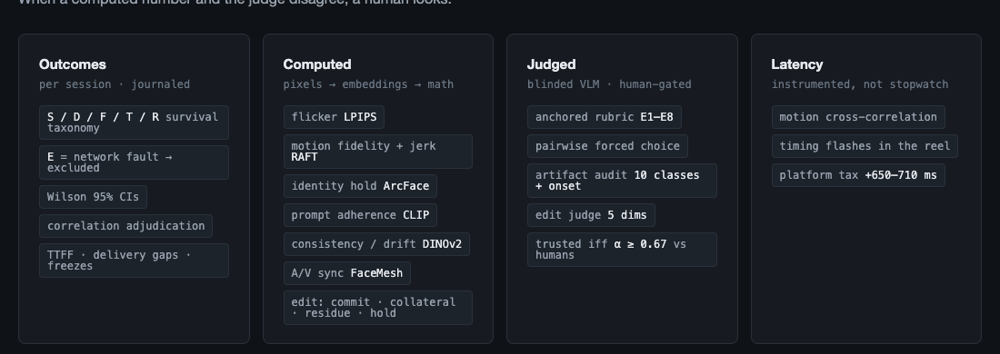

# RTV-Bench

**The benchmark for realtime video AI — measured live, or not at all.**

Offline benchmarks judge cherry-picked renders. Realtime products live or
die on things a render can't show: whether a session survives minute
thirty, whether your face is still yours at minute two, whether "make it a
red hoodie" lands mid-stream without breaking the world. RTV-Bench opens
**real streaming sessions against real product endpoints**, records every
delivered frame, attributes every failure, and turns append-only journals
into scores that survive hostile review.

**📊 Reference-run results (2026-08, four products): [`docs/RESULTS.md`](docs/RESULTS.md)**
· interactive figures: [`docs/atlas.html`](docs/atlas.html) · spec: [`BENCHMARK.md`](BENCHMARK.md)

---

## Two tracks, two sports

The products do fundamentally different jobs, so RTV-Bench is two
evaluation systems under one roof — the same reason MLPerf scores training
and inference separately. Nothing crosses tracks.

**🎥 Track 1 — Interactive video (V2V).** *Your camera in, a transformed
you out, live.* Scored on: session survival across durations · blind
same-input side-by-sides · identity persistence over minutes · live
mid-stream editing (clothes, hair, background, style, whole characters) ·
motion-to-glass latency · market reachability.

**🌍 Track 2 — Interactive worlds.** *A prompt in, an explorable world
out, steered as it runs.* Scored on: did it build what was asked (counts,
colors, positions are checkable by design) · physics · object permanence ·
does the world stay the same world over a minute · does a text direction
visibly steer the story · build speed.

## What makes a session a measurement

```
STIMULUS → SESSION → GUARDS → MEASURE → SCORE
```

- **Fixed, hashed stimulus** — filmed corpus conformed per product; a reel
  with timing flashes baked into its pixels so latency is measurable
  through any transform; world-prompts with verifiable assertions.
- **Real sessions** — WebRTC, vendor SDKs, or the vendor's own browser SDK
  driven headlessly when that's the only client. Every delivered frame
  recorded lossless, every timing journaled.
- **Network guards** — a throughput sentinel that refuses to launch into a
  sag, in-run drift/loss checks, and post-hoc cross-product adjudication.
  Bad-network runs are *excluded with evidence*, never blamed on products.

## Four instruments, one capture

Every capture is read four independent ways — each instrument blind to
what the others see, so agreement means something:

| instrument | what it catches |
|---|---|
| **Outcome taxonomy** | survival: clean / degraded / failed / network-fault, with Wilson CIs |
| **Computed metrics** | flicker (LPIPS) · motion fidelity & physics pops (RAFT) · identity hold (ArcFace) · prompt adherence (CLIP) · scene drift (DINOv2) · A/V sync (FaceMesh) · purpose-built edit metrics: commit latency, targeting precision, residue, stability |
| **Blinded VLM judge** | anchored rubric scores · pairwise forced-choice · a 10-class artifact audit with *onset times* · a 5-dim live-edit judge — trusted only where it matches human raters (α ≥ 0.67), extreme calls verified by human eyes |
| **Latency instruments** | motion cross-correlation through the transform; the same model dual-routed to price an aggregator's overhead |



## Scores with their opinions on the outside

Numbers roll up: rates with confidence intervals → anchored 0–100 axis
scores → **declared-weight profiles** (a China-streaming buyer and a
creative-tool buyer weight the axes differently — both weightings are
printed, both overridable with `--weights`) → hard floors so no product
averages away a disqualifying flaw. Everything computed **per lens**: a
model measured through a middleman platform never shares a table with
native measurements — the middleman's tax is its own number.

## The honesty machinery

1. Lens separation — routes never mix.
2. Failure attribution — product, network, or rig, with evidence; every
   human override logged in an adjudication file.
3. Judges on a leash — blinding, hidden repeats, schema-forced verdicts,
   human agreement gates, per-run blinding keys.
4. Fixed stimulus, dated snapshots, declared vantage.
5. Self-applied: our own mistakes are documented in-repo, not scrubbed.

**Every number is walkable**: composite → axis → scorecard → raw records →
the individual blinded verdict with the judge's own evidence text.

## Get running

```bash
python3 setup.py          # guided setup: prereqs, venvs, deps, keys,
                          # live validation, self-test — safe to re-run
python3 setup.py --check  # health report only
```

Then:

```bash
.venv/bin/python tools/benchmark_run.py --list      # stages
.venv/bin/python tools/benchmark_run.py reliability # or quality/editing/worlds
.venv/bin/python tools/benchmark_run.py score       # scorecard + report
```

Every stage journals and resumes; rerunning is always safe. The wizard
ends by telling you which campaigns your keys unlock.

## Add a product

Implement one adapter (`connect / run / close`, frames via `frame_tap`) —
or copy the headless-browser lane pattern for browser-SDK-only products —
register it in the campaign drivers, and declare its lens honestly. The
rest of the machinery is product-agnostic.

## Map

```
BENCHMARK.md          spec: axes, profiles, floors, ground rules, versioning
docs/RESULTS.md       reference-run results (all of them)
docs/atlas.html       the results + pipeline, drawn
setup.py              the wizard
rtveval/              adapters · judges · metrics · orchestrator
tools/                campaign drivers · browser lanes · benchmark_{run,score,report}
data/                 the full evidence chain: journals, adjudications,
                      every judge verdict, every computed record, scorecard
```

Built 2026-08-10 → 08-15 inside a six-product commercial evaluation from a
mainland-China vantage. Every rule above exists because it caught a real
mistake that week.
