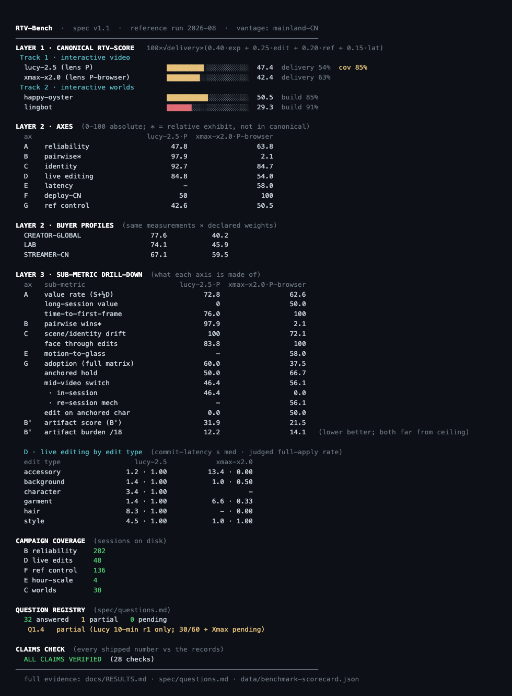

# RTV-Bench

**The benchmark for realtime video AI — measured live, or not at all.**

Offline benchmarks judge cherry-picked renders — and the biggest eval
suites in the world can only race each other at that game. Realtime
products live or die on things **no render can show and no offline suite
can measure**: whether a session survives minute thirty, whether your
face is still yours at minute two, whether "make it a red hoodie" lands
mid-stream without breaking the world, whether a reference image can
anchor — and switch — a live character. **Interaction is this benchmark's
home turf**: 60% of the canonical score is interaction axes (live
editing, reference control, latency), and even the quality terms are
measured *inside directed live sessions*. RTV-Bench opens **real
streaming sessions against real product endpoints**, records every
delivered frame, attributes every failure, and turns append-only journals
into scores that survive hostile review.

## The leaderboard (reference run 2026-08 · spec v1.1)

One canonical **RTV-Score** per product, per track — tracks are separate
sports and never share a ladder:

| Track 1 · Interactive video | RTV-Score | | Track 2 · Interactive worlds | RTV-Score |
|---|---|---|---|---|
| **Lucy 2.5** (native) | **47.4** | | **Happy Oyster** | **50.5** |
| Xmax X2.0 (native/browser) | 42.4 | | LingBot-World 2 | 29.3† |

`RTV-Score = 100 × √delivery × (0.40·experience + 0.25·editing +
0.20·ref-control + 0.15·latency)` — availability gates multiplicatively
(√-damped for vantage fairness); the core uses only **absolute-anchored**
components, so scores don't shift when the field changes. **v1.1 adds
reference-image control as a scored axis** (campaign F, 130 sessions) —
notably Xmax's first capability-axis win (50.5 vs 42.6) while Lucy leads
overall. Relative results — like Lucy's 64–0 blind head-to-head sweep —
are published beside the ladder, never inside it.

† LingBot's score is **flagged invalid (2026-08-18)**: the reference run
anchored this image-anchored model on a degenerate synthetic seed image
(a featureless mockup — the seed IS the world's visual identity), with
transport corruption on top — benchmark-side stimulus/rig bugs caught by
a human rater during judge calibration. (First diagnosis said the anchor
was never sent; corrected same day — it was sent, but degenerate.) The
score stays visible, struck, pending a proper-seed rerun
(`spec/invocation-playbooks.md`, rule zero: our mistakes stay documented,
not scrubbed).

| Buyer profile | Lucy 2.5 | Xmax X2.0 |
|---|---|---|
| STREAMER-CN (China live-avatar) | **67.7** | 59.9 |
| CREATOR-GLOBAL (creative tool) | **78.1** | 40.5 |
| LAB (unweighted capability) | **74.7** | 45.9 |

Buyer-weighted views (China-streaming, creative-tool), axis breakdowns,
and every number's evidence: **[`docs/RESULTS.md`](docs/RESULTS.md)** ·
figures: [`docs/atlas.html`](docs/atlas.html) · spec: [`BENCHMARK.md`](BENCHMARK.md)

---

## Two tracks, two sports

The products do fundamentally different jobs, so RTV-Bench is two
evaluation systems under one roof — the same reason MLPerf scores training
and inference separately. Nothing crosses tracks.

**Track 1 — Interactive video (V2V).** *Your camera in, a transformed
you out, live.* Scored on: session survival across durations · blind
same-input side-by-sides · identity persistence over minutes · live
mid-stream editing (clothes, hair, background, style, whole characters) ·
**reference-image character control** (anchor, attribute transfer,
multi-minute identity hold, mid-video switching — scored by face-identity
timelines, campaign F) · motion-to-glass latency · market reachability.

**Track 2 — Interactive worlds.** *A prompt in, an explorable world
out, steered as it runs.* Scored on: did it build what was asked (counts,
colors, positions are checkable by design) · physics · object permanence ·
does the world stay the same world over a minute · does a text direction
visibly steer the story · build speed.

## What makes a session a measurement

```
STIMULUS → SESSION → GUARDS → MEASURE → SCORE
```

- **Fixed, hashed stimulus** — filmed corpus conformed per product; a reel
  with timing flashes baked into its pixels so latency is measurable
  through any transform; world-prompts with verifiable assertions.
- **Real sessions** — WebRTC, vendor SDKs, or the vendor's own browser SDK
  driven headlessly when that's the only client. Every delivered frame
  recorded lossless, every timing journaled.
- **Network guards** — a throughput sentinel that refuses to launch into a
  sag, in-run drift/loss checks, and post-hoc cross-product adjudication.
  Bad-network runs are *excluded with evidence*, never blamed on products.

## Four instruments, one capture

Every capture is read four independent ways — each instrument blind to
what the others see, so agreement means something:

| instrument | what it catches |
|---|---|
| **Outcome taxonomy** | survival: clean / degraded / failed / network-fault, with Wilson CIs |
| **Computed metrics** | flicker (LPIPS) · motion fidelity & physics pops (RAFT) · identity hold (ArcFace) · prompt adherence (CLIP) · scene drift (DINOv2) · A/V sync (FaceMesh) · purpose-built edit metrics: commit latency, targeting precision, residue, stability |
| **Blinded VLM judge** | anchored rubric scores · pairwise forced-choice · a 10-class artifact audit with *onset times* · a 5-dim live-edit judge — trusted only where it matches human raters (α ≥ 0.67), extreme calls verified by human eyes |
| **Latency instruments** | motion cross-correlation through the transform; the same model dual-routed to price an aggregator's overhead |


## Scores with their opinions on the outside

Numbers roll up: rates with confidence intervals → anchored 0–100 axis
scores → **declared-weight profiles** (a China-streaming buyer and a
creative-tool buyer weight the axes differently — both weightings are
printed, both overridable with `--weights`) → hard floors so no product
averages away a disqualifying flaw. Everything computed **per lens**: a
model measured through a middleman platform never shares a table with
native measurements — the middleman's tax is its own number.

## The honesty machinery

1. Lens separation — routes never mix.
2. Failure attribution — product, network, or rig, with evidence; every
   human override logged in an adjudication file.
3. Judges on a leash — blinding, hidden repeats, schema-forced verdicts,
   human agreement gates, per-run blinding keys.
4. Fixed stimulus, dated snapshots, declared vantage.
5. Self-applied: our own mistakes are documented in-repo, not scrubbed.

**Every number is walkable**: composite → axis → scorecard → raw records →
the individual blinded verdict with the judge's own evidence text.

## Get running

```bash
python3 setup.py          # guided setup: prereqs, venvs, deps, keys,
                          # live validation, self-test — safe to re-run
python3 setup.py --check  # health report only
```

Then:

```bash
.venv/bin/python tools/dash.py run    # launch any campaign from a menu -
                                      # readiness-checked, detached, logged
.venv/bin/python tools/dash.py        # results dashboard (any time)
```

(Raw stage commands — `tools/benchmark_run.py <stage>` — remain for
scripting; every stage is resumable, so rerunning is always safe.)

Results are **handed to you by the machine**: `tools/dash.py` renders three
layers (canonical ladders → axes/profiles → sub-metric drill-down) straight
from `data/`, plus coverage, registry status, and the claims-checker verdict
— the docs are prose over the same records, and `claims_check` keeps them
honest. More: `--watch 10` (live mission control with an in-flight ticker),
`--why G` (evidence chain for any axis down to individual runs), `--weights`
(re-editorialize with your own weights — the declared opinions are
overridable by design), `--vendor xmax` (one product's cut), `--md`/`--json`
(export), and Δ-since-last-run markers once scoring history accumulates.
On a fresh machine it detects missing keys and hands you to the setup
wizard instead of erroring.



Every stage journals and resumes; rerunning is always safe. The wizard
ends by telling you which campaigns your keys unlock.

## Open contributions

Two ready-to-run datapoints await anyone with an hour: a **second
vantage** (cloud VM, `docs/MULTI-VANTAGE.md`) and **judge-calibration
ratings** (blinded browser UI, `docs/SUBMITTING.md` §standing open
contributions). Tooling is complete; results slot in as first-class data.

## Add a product

Implement one adapter (`connect / run / close`, frames via `frame_tap`) —
or copy the headless-browser lane pattern for browser-SDK-only products —
register it in the campaign drivers, and declare its lens honestly. The
rest of the machinery is product-agnostic.

## Map

```
BENCHMARK.md          spec: axes, profiles, floors, ground rules, versioning
GOVERNANCE.md         how the benchmark changes: versioning, amendments,
                      what makes a result official, disputes, submissions
spec/questions.md     THE question registry — every question the benchmark
                      asks: campaign, stimulus, instrument, metric, records,
                      answer status. Nothing scattered.
spec/invocation-playbooks.md   per-product correct invocation + every
                      discovered trap (wrong invocation ≠ product finding)
docs/RESULTS.md       reference-run results (all of them)
docs/atlas.html       the results + pipeline, drawn
setup.py              the wizard
rtveval/              adapters · judges · metrics · orchestrator
tools/                campaign drivers · browser lanes · benchmark_{run,score,report}
data/                 the full evidence chain: journals, adjudications,
                      every judge verdict, every computed record, scorecard
```

Built from a mainland-China vantage. Every rule above exists because it caught a real
mistake that week.
