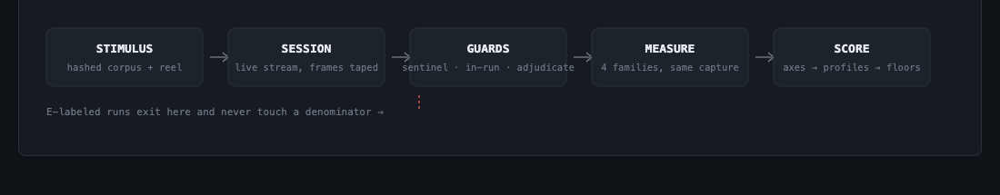

# RTV-Bench — a benchmark for realtime video AI products

Live products, live measurements: does a realtime video model **stay up,
look right, react fast, and take mid-stream direction?** RTV-Bench runs
real streaming sessions against real product endpoints — no offline
renders, no cherry-picked clips — records every delivered frame, and turns
append-only journals into defensible scores.

Born inside a six-product commercial evaluation (2026-08-10 → 08-15) run
from a mainland-China vantage; every rule below exists because it caught a
real mistake during that week.

**Products in the reference run:** Lucy 2.5 (Decart) · Xmax X2.0 ·
LingBot-World 2 (Ant) · Happy Oyster (Alibaba). PixVerse R1 and Vidu S1
were access-gated and are listed as not-evaluable rather than guessed at.

---

## The two tracks

RTV-Bench is **two evaluation systems under one roof**, because the products
do two fundamentally different jobs — the same reason MLPerf scores training
and inference separately, and VBench keeps text-to-video suites apart. A
product competes only inside its own track; nothing crosses.

### Track 1 — Interactive video models (V2V)
*Your camera goes in, a transformed you comes out, live.*
**Products:** Lucy 2.5, Xmax X2.0.
**What's evaluated:** does a live session survive and stay smooth · how good
the transformed video looks (blind side-by-side against the other product on
identical input) · does your face stay your face over minutes · can you
change clothes / hair / background / style / character **while the stream is
running**, and does the stream survive the change · how fast your movement
reaches the screen · whether the product is reachable in the target market.

### Track 2 — Interactive world models
*A text prompt goes in, an explorable world comes out, and you steer it.*
**Products:** LingBot-World 2, Happy Oyster.
**What's evaluated:** did it build what the prompt actually asked (counts,
colors, spatial relations are checkable on purpose) · does the world obey
physics (gravity, collisions) · do things that leave the frame still exist
when you come back (object permanence) · does the world stay the same world
over a minute, or slowly melt · does a mid-stream text instruction visibly
steer the story · how long a world takes to build and how long you can
travel it.

Shared between tracks: only infrastructure measurements (session
reliability method, platform overhead) — never quality scores.

---



## 1. Track 1 results — interactive video (reference run, 2026-08)

Scores are 0–100, computed per **lens** (route to the product — see §4;
lenses never merge). Three declared-weight profiles answer three different
buyer questions:

| Profile | asks | Lucy 2.5 (native) | Xmax X2.0 (native/browser) |
|---|---|---|---|
| **STREAMER-CN** | "power a China-market live-avatar product" | **74.1** | 62.4 |
| **CREATOR-GLOBAL** | "power a creative restyling tool" | **86.0** | 39.9 |
| **LAB** | "pure capability, no market weighting" | **79.4** | 48.7 |

The quotable sentence: **Lucy wins every profile, but the gap collapses
from 46 points (creative use) to 12.7 (China streaming use)** — Xmax's
instant whole-scene restyle, China-direct availability, and edit-time
identity stability are worth that much in its home market.


### Axis detail behind those composites

| Axis (0–100) | Lucy 2.5 (P) | Xmax X2.0 (P-browser) | what it measures |
|---|---|---|---|
| A Reliability | 48.7 | 63.8 | session value rate (S + ½·D), long-session robustness, TTFF |
| B Quality | 97.9 | 2.1 | blinded same-input pairwise wins (rubric-weighted) |
| C Identity | 92.7 | 84.7 | long-horizon embedding drift + face-through-edits |
| D Live editing | 84.8 | 54.0 | commit latency, application, precision, hold, transition |
| E Latency | n/a* | 58.0 | instrumented motion-to-glass (983 ms styled for Xmax native) |
| F Deploy-CN | 50 | 100 | China-market reachability (direct / VPN-viable / blocked) |

\* not instrumented on that lens; weights renormalize and the coverage %
is printed with the score. Hard floors apply (e.g. reliability < 40 caps
the total) and are printed whenever they bite. Every weight lives in one
JSON block in `tools/benchmark_score.py`; `--weights yours.json`
re-editorializes everything.

---

## 2. Headline findings of the reference run

**Same-input blinded quality (64 pairs):** Lucy 64–0 at clip level
(temporal 64-0, structure 60-4, style 61-0-3, detail 64-0). Adversarially
verified in both directions — the judge's rare Xmax wins map to real Lucy
single-frame collapses; Lucy's wins include a full identity replacement on
the Xmax side within 12 s.

**Live mid-stream editing (48 sessions, 9 edit types):**

| edit type | Lucy 2.5 | Xmax X2.0 |
|---|---|---|
| whole-scene style flip | works, 4.6 s | **wins: 1.0 s, zero collateral** |
| garment swap | **1.4 s, clean, holds** | commits at 6.6 s, mostly partial |
| background swap | **works** | 50% commit, rewrites whole frame |
| accessory | **1.2 s clean** | mostly fails |
| hair | works but blends back (35% hold) | total failure |
| ref-image character switch | **applies, 3.4 s, holds** | untested (phase 2) |

Pattern: Lucy edits *surgically* (with moderate whole-scene collateral);
Xmax either restyles the entire world or does nothing.


**Reliability (adjudicated, per lens):** Lucy native N=210 — 36% clean /
37% degraded / 26% failed, with failures concentrated in tunnel-sag
windows (356 additional runs excluded as network-fault rather than
blamed); Xmax via aggregator N=85 — 55/33/12; Xmax native-browser N=91 —
a systematic ~2 s early-stream freeze marks 68/91 sessions degraded.

**Platform tax:** the same Xmax model measured native vs through the
Reactor aggregator shows **+650–710 ms** added latency — why Lens M and
Lens P never share a table.

### Track 2 results — interactive worlds

Frame-computed metrics (no judging involved — direct measurement):

| metric | LingBot-World 2 | Happy Oyster | edge |
|---|---|---|---|
| subject consistency (same scene stays same) | 0.836 | **0.900** | HO |
| long-horizon hold (start vs 1 min later) | 0.685 | **0.759** | HO |
| motion pops (teleports/min, lower better) | 37.3 | **23.3** | HO |
| temporal flicker score (higher steadier) | **0.997** | 0.985 | LingBot |
| world build+capture time (median) | **~55 s** | ~138 s | LingBot 2.5× faster |

**Steerability — HO's clear win:** its `instruct()` returns explicit
accept/reject receipts and supports pause/resume/rewind; LingBot's steering
is fire-and-forget (only the pixels tell you if it worked).

The trade-off, plainly: **Happy Oyster builds better, steadier, more
steerable worlds; LingBot builds worlds 2.5× faster.** Samples: LingBot
21/21, HO 11/21 (remainder limited by the measurement vantage's network,
not the product). The blinded-judge layer over these worlds is being
re-run after a blinding-key tooling bug (fixed; keys now per-run) — the
computed direction above does not depend on it.

**Engineering traps documented** (docs/): two mirror-image silent-failure
shapes in the Xmax SDK (connect requires `context.prompt`, live update
requires flat `prompt`; the wrong shape silently no-ops in each place);
Happy Oyster's undocumented second-connection architecture; session-time-
dominated aggregator billing.

---

## 3. What runs, exactly


```
STIMULUS  fixed, hashed: filmed 10-clip corpus -> instrumented reel
          (timing flashes) -> per-product conforms; G-prompt battery with
          checkable assertions; external mixkit clips + ref portraits
   |
SESSION   real streaming session per slot (WebRTC / vendor SDK / headless
          browser for browser-only SDKs), frames recorded lossless at
          delivery, session journal appended
   |
GUARDS    throughput sentinel holds before launch; in-run drift/loss
          checks mark E; wall-clock kills bound everything; post-hoc
          cross-product correlation adjudication (all overrides logged)
   |
MEASURE   4 families off the same capture:
          outcomes (S/D/F/T/R/E)  ·  computed metrics (LPIPS flicker,
          RAFT motion fidelity + jerk, ArcFace identity, CLIP adherence,
          DINO consistency/drift, FaceMesh A/V-sync; purpose-built edit
          metrics for campaign D)  ·  blinded VLM judging (absolute
          anchored rubric, pairwise forced-choice, 10-class artifact audit
          with onset windows, 5-dim edit judge)  ·  latency instruments
          (motion cross-correlation; platform-delta by dual routing)
   |
SCORE     rates with Wilson CIs -> anchored axis scores -> declared-weight
          profiles with hard floors -> per-lens composites
```

### Campaigns

| Campaign | question | drivers |
|---|---|---|
| B | reliability across 15 s / 60 s / 3 min sessions, high N | `tools/campaign_b.py` (+ `xmax_native_lane.py` browser lane) |
| B v2 | quality of what was delivered (pairs + audit) | `campaign_b_v2.py`, `metrics_sweep.py`, `vlm_judge_run.py` |
| D | mid-stream editing: instruction at t=15 s into a live stream | `campaign_d.py`, `campaign_d_xmax.py`, `edit_metrics_run.py`, `edit_judge_run.py` |
| C | world generation: build/steer/hold a world | `campaign_c_gen.py`, `ho_native_lane.py` |
| bridge | platform overhead: same model, two routes | latency instruments in `rtveval/latency/` |

---

## 4. Ground rules (the honesty machinery)

1. **Lens separation.** Lens P = vendor's native API. Lens M = via an
   aggregator platform (its overhead measured separately). P-browser =
   official browser SDK driven headlessly (its own failure modes). Scores
   and tables never mix lenses.
2. **Outcome attribution.** S clean · D degraded · F failed · T/R
   truncated/refused · E rig-or-network fault. Only product-fault outcomes
   enter denominators. E requires positive evidence; ambiguity goes to
   review, not to a verdict.
3. **Blinded judging with a leash.** The VLM judge sees shuffled,
   re-blinded frames, must emit schema-forced verdicts with citable
   evidence, self-checks via hidden repeats, and is trusted only where it
   matches human ratings (Krippendorff α ≥ 0.67 — human panel served by
   `tools/rating_session.py`). Extreme calls get human eyeball
   verification (see the r261/r281 exhibits in docs/).
4. **Fixed, versioned stimulus.** Bit-identical inputs on rerun.
5. **Dated snapshots.** Server builds are recorded; providers hot-deploy;
   results are dated claims.
6. **Declared vantage.** Network position is pinned and recorded; the
   guards hold rather than corrupt when the network is unfit.
7. **Self-applied honesty.** Mistakes get documented in-repo, not
   scrubbed: see `docs/` incident reports and
   `data/campaign-b/JOURNAL-LOSS-NOTE.md`.

---

## 5. Quickstart

One command sets everything up — prerequisites, both virtualenvs,
dependencies, `.env`, live key validation, and a self-test:

```bash
python3 setup.py          # guided setup; safe to re-run
python3 setup.py --check  # report-only health check
```

It ends by telling you which campaigns your keys unlock. Manual
equivalent, if you prefer:

```bash
python3.12 -m venv .venv && uv pip install --python .venv/bin/python -r requirements.txt
python3.12 -m venv .venv-metrics && uv pip install --python .venv-metrics/bin/python -r requirements-metrics.txt
cp .env.example .env    # provider keys; never committed

.venv/bin/python tools/benchmark_run.py --list
.venv/bin/python tools/benchmark_run.py reliability    # campaign B
.venv/bin/python tools/benchmark_run.py quality        # metrics + pairs + audit
.venv/bin/python tools/benchmark_run.py editing        # campaign D end-to-end
.venv/bin/python tools/benchmark_run.py worlds         # campaign C
.venv/bin/python tools/benchmark_run.py rate           # human rating panel
.venv/bin/python tools/benchmark_run.py score          # scorecard + report
```

Every stage journals and resumes; rerunning is always safe. Outputs:
`data/benchmark-scorecard.json`, `docs/report-generated.md` (mechanical,
regenerates correct on every rerun), `docs/final-report.md` (editorial
narrative of the reference run).

## 6. Adding a product

1. Write an adapter in `rtveval/adapters/` implementing `Adapter`:
   `connect() / run(clip, prompt, duration, condition) / close()`, frames
   surfaced via `frame_tap`. Browser-SDK-only products: copy the
   `tools/xmax_native_lane.py` + `tools/xmax_browser/` pattern (serve the
   official SDK in headless Chrome, feed the conform as the input track,
   canvas-record the output).
2. Register in the campaign drivers; add prompt-shape quirks there, not in
   shared code.
3. Declare the lens honestly. If the product is also reachable through an
   aggregator, wire both routes — that's how the platform tax gets its
   number.

## 7. Repo map

```
BENCHMARK.md                 spec: axes, profiles, floors, versioning
rtveval/
  adapters/                  decart aiortc, reactor sdk, session plumbing
  vlm_judge.py               rubric + pairwise + audit judges, blinding, α-gate
  edit_metrics.py            campaign-D purpose-built metrics
  quality_metrics.py, vbench_metrics.py, latency/, orchestrator/
tools/
  benchmark_{run,score,report}.py
  campaign_{b,c_gen,d,d_xmax,b_v2}.py, *_native_lane.py, xmax_browser/
  rating_session.py          blinded human panel w/ hidden repeats
  metrics_sweep.py, edit_metrics_run.py, edit_judge_run.py, vlm_judge_run.py
docs/                        final report, d-scorecard, atlas, incidents
data/                        the full evidence chain:
  campaign-b/                reliability journals + adjudications.json
  campaign-b-native/         browser-lens reliability journal
  vlm-judge-b-pairs/         the 64 pairwise verdicts, evidence text included
  vlm-judge/ · vlm-judge-audit/ · edit-judge/   all judge records
  vlm-judge-key/             blinding keys (written PER RUN - key-<ts>.json)
  quality-metrics/ · edit-metrics/              computed-metric records
  benchmark-scorecard.json   the roll-up everything above feeds
```

**Every number is walkable.** Any figure in this README traces down:
composite → axis → scorecard entry → raw records → individual blinded
verdicts with the judge's own evidence text, or journal rows with
timestamps. The adjudication log records every human override, with
reasons. If you disagree with a score, the disagreement can be located.

## 8. Known limitations of the reference run

- Reliability absolute rates carry the measured-from-this-vantage caveat;
  cross-product *comparisons* on the same lens are the robust readout.
- Lucy's captures are lossless taps while Xmax's browser lane re-encodes
  (VP8): a quality-pair caveat, partially discharged by the judge crediting
  Xmax where deserved and by content-based evidence.
- Some journal row-tails for campaign B were lost to a git incident after
  aggregates were computed and committed (documented in
  `data/campaign-b/JOURNAL-LOSS-NOTE.md`); affected slots re-run.
- Happy Oyster sample is 11/21; Xmax Lens M tail still accruing.
