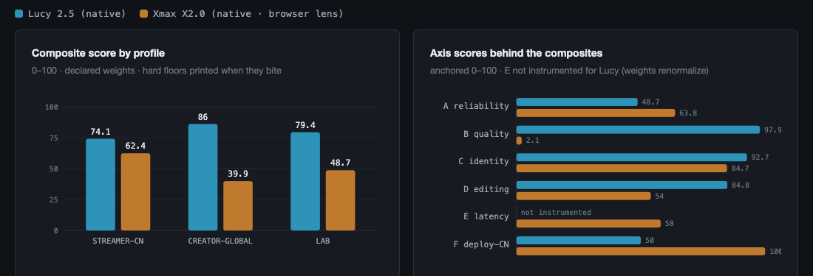
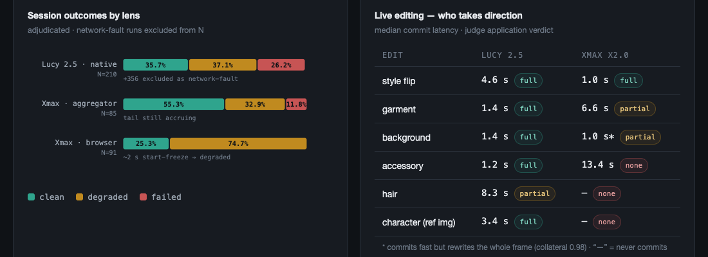

# RTV-Bench — Reference Run Results (2026-08)

> Products: Lucy 2.5 (Decart) · Xmax X2.0 · LingBot-World 2 (Ant) · Happy
> Oyster (Alibaba). PixVerse R1 and Vidu S1 were access-gated: listed as
> not-evaluable, not guessed at.
> Vantage: mainland-China residential, pinned per campaign. All numbers
> re-derivable from `data/` journals; methodology in [`../BENCHMARK.md`](../BENCHMARK.md).

---

## Track 1 — Interactive video (Lucy 2.5 vs Xmax X2.0)

**RTV-Score (canonical): Lucy 65.8 · Xmax 54.3** — formula
`100 × √delivery × (0.45·experience + 0.35·interaction + 0.20·latency)`,
absolute components only; the pairwise sweep below is the relative exhibit.

### Composite scores (declared-weight profiles, per lens)

| Profile | asks | Lucy 2.5 (native) | Xmax X2.0 (native/browser) |
|---|---|---|---|
| **STREAMER-CN** | "power a China-market live-avatar product" | **74.1** | 62.4 |
| **CREATOR-GLOBAL** | "power a creative restyling tool" | **86.0** | 39.9 |
| **LAB** | "pure capability, no market weighting" | **79.4** | 48.7 |

**Lucy wins every profile, but the gap collapses from 46 points (creative
use) to 11.7 (China streaming use)** — Xmax's instant whole-scene restyle,
China-direct availability, and edit-time identity stability are worth that
much in its home market.

### Axis detail

| Axis (0–100) | Lucy 2.5 (P) | Xmax X2.0 (P-browser) | what it measures |
|---|---|---|---|
| A Reliability | 48.7 | 63.8 | session value rate (S + ½·D), long-session robustness, TTFF |
| B Head-to-head preference* | 97.9 | 2.1 | blinded same-input pairwise wins (relative, two-product field) |
| C Identity | 92.7 | 84.7 | long-horizon embedding drift + face-through-edits |
| D Live editing | 84.8 | 54.0 | commit latency, application, precision, hold, transition |
| E Latency | n/a† | 58.0 | instrumented motion-to-glass (983 ms styled, Xmax native) |
| F Deploy-CN | 50 | 100 | China-market reachability (direct / VPN-viable / blocked) |

\* B is currently pairwise-only (its absolute artifact-burden component
awaits an audit re-run after a blinding-key incident) — read it as "how
often the blinded judge preferred this product over its rival on identical
input," not as absolute quality. In a two-product field the loser of a
lopsided matchup necessarily scores near zero.
† not instrumented on that lens; weights renormalize and coverage % prints
with the score.

### Same-input blinded quality (64 pairs)

**Lucy 64–0 at clip level** (temporal 64-0, structure 60-4, style 61-0-3,
detail 64-0). Adversarially verified in both directions — the judge's rare
Xmax wins map to real Lucy single-frame collapses; Lucy's wins include a
full identity replacement on the Xmax side within 12 s.

Xmax's two systematic failures: a **~2 s early-stream freeze** (nearly
every session) and **progressive identity morph** (within a single continuous shot the subject becomes a different person — replayable example completes in ~12 s; judge-confirmed across independent pairs; systematic onset timing deferred to the v1.1 long-session arm). Lucy's failures are rare single-frame
collapses that self-recover within a second.

### Live mid-stream editing (48 sessions, 9 edit types)

| edit type | Lucy 2.5 | Xmax X2.0 |
|---|---|---|
| whole-scene style flip | works, 4.6 s | **wins: 1.0 s, zero collateral** |
| garment swap | **1.4 s, clean, holds** | commits at 6.6 s, mostly partial |
| background swap | **works** | 50% commit, rewrites whole frame |
| accessory | **1.2 s clean** | mostly fails |
| hair | works but blends back (35% hold) | total failure |
| ref-image character switch | **applies, 3.4 s, holds** | untested (phase 2) |

Pattern: Lucy edits *surgically* (moderate whole-scene collateral); Xmax
either restyles the entire world or does nothing. The style flip — Xmax's
one win — happens to be the core interaction of its own product plan.

### Reliability (adjudicated, per lens — lenses never compared directly)

| entity | N | clean | degraded | failed | note |
|---|---|---|---|---|---|
| Lucy 2.5 · native | 210 | 36% | 37% | 26% | failures cluster in tunnel-sag windows; +356 runs excluded as network-fault |
| Xmax · via aggregator | 85 | 55% | 33% | 12% | tail still accruing |
| Xmax · native browser | 91 | 25% | 75% | 0% | the ~2 s start-freeze marks sessions degraded |

### Hour-scale preview (campaign E, v1.1 — first datapoint)

One 10-minute Lucy session on a single-shot looped face (telemetry +
identity stills every 10 s): **no identity drift over 9 continuous
minutes** — face similarity to t=0 median 0.86, never below 0.75, no
decay trend — and delivery held a flat 17.2 fps throughout. Session ended
at 536 s by provider credit exhaustion, not product failure. Xmax
counterpart + 30/60-min tiers pending credits.

### Latency & platform tax

- Xmax native styled motion-to-glass: **~983 ms** (instrumented, direct
  domestic route).
- Lucy styled motion-to-glass **measured ≈2.6–2.7 s from this vantage**
  (two concordant timestamped probes, z≈3.7) — but that path rides the VPN
  tunnel + TCP relay, so it is **not comparable** to Xmax's direct-route
  figure and is excluded from axis scoring; her clean-route latency needs a
  non-tunneled vantage (v1.1).
- Same model through the Reactor aggregator: **+650–710 ms** — the
  measured cost of the middleman, and the reason lenses never share tables.

### Market access (often the deciding row)

Lucy is unreachable from mainland China without a well-behaved VPN — and
this run *measured* how fragile that path is. Xmax connects domestically
with zero ceremony and sailed through the same network weather untouched.
For a China-market product, the V2V field effectively has one entrant.

---

## Track 2 — Interactive worlds (LingBot-World 2 vs Happy Oyster)

**Track-2 RTV-Score** = 100 × √(build-success) × (adherence 35 /
long-horizon 25 / physics 20 / steering 20): **Happy Oyster 50.5 ·
LingBot 29.3** — HO's adherence, hold, and steering outweigh LingBot's
2.5× build speed (speed is exhibited beside the score, not inside it).

Frame-computed metrics (direct measurement, no judging involved):

| metric | LingBot-World 2 | Happy Oyster | edge |
|---|---|---|---|
| subject consistency (same scene stays same) | 0.836 | **0.900** | HO |
| long-horizon hold (start vs 1 min later) | 0.685 | **0.759** | HO |
| motion pops (teleports/min, lower better) | 37.3 | **23.3** | HO |
| temporal flicker score (higher steadier) | **0.997** | 0.985 | LingBot |
| world build+capture time (median) | **~55 s** | ~138 s | LingBot 2.5× faster |

Blinded-judge medians (1–5 anchored scale, re-run with clean keys):

| dimension | LingBot | Happy Oyster |
|---|---|---|
| prompt adherence (E6) | 2 | **3** |
| physical plausibility (E7) | 2 | 2 |
| long-horizon consistency (E8) | 2 | **3** |

Two independent instruments — per-frame math and a blinded judge — agree
on the direction. That's the benchmark's redundancy doing its job.

**Steerability — HO's clear win:** `instruct()` returns explicit
accept/reject receipts and supports pause/resume/rewind; LingBot's steering
is fire-and-forget.

The trade-off, plainly: **Happy Oyster builds better, steadier, more
steerable worlds; LingBot builds worlds 2.5× faster.** Samples: LingBot
21/21, HO 11/21 (remainder limited by the vantage's network, not the
product).

---

## Engineering findings (vendor-actionable)

- **Two mirror-image silent traps in the Xmax SDK**: connect requires
  `context.prompt` (flat ignored); live update requires flat `prompt`
  (context form ignored). Both "succeed" silently when wrong.
- **Happy Oyster's second-connection architecture**: the main session track
  is a placeholder by design; real frames ride a second Aliyun RTC
  connection only the dedicated SDK opens.
- **Aggregator billing** is dominated by session time (world-builds,
  connect overhead), not streamed video.

## Known limitations of this run

- Absolute reliability rates carry the measured-from-this-vantage caveat;
  same-lens comparisons are the robust readout.
- Lucy's captures are lossless taps while Xmax's browser lane re-encodes
  (VP8) — partially discharged by the judge crediting Xmax where deserved.
- Campaign-B journal row-tails were lost to a git incident after aggregates
  were computed and committed (`data/campaign-b/JOURNAL-LOSS-NOTE.md`);
  affected slots re-run.
- Track 2's judge layer re-running post key-incident; B-axis audit
  component pending the same restoration.
